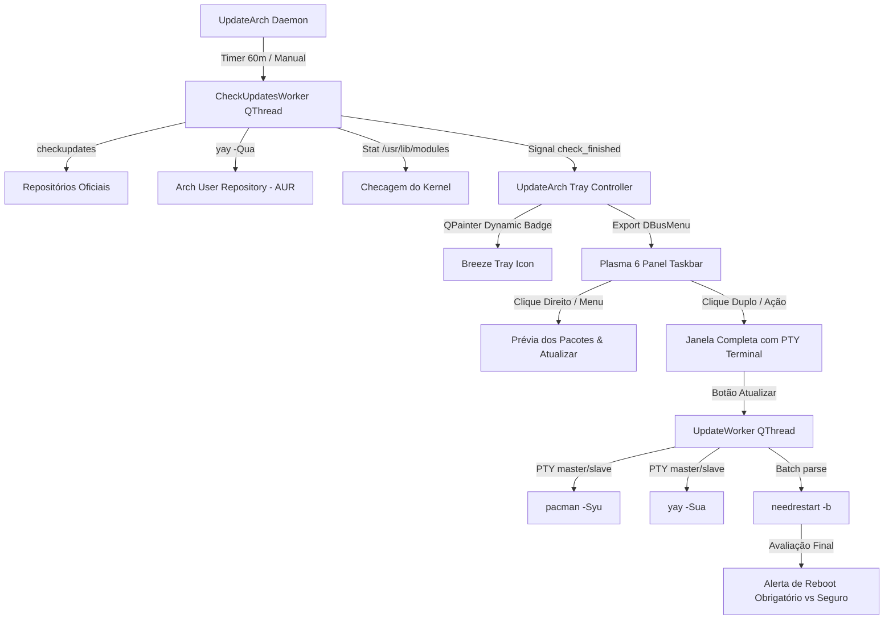

# UpdateArch

[](LICENSE)
[](https://archlinux.org)
[](https://python.org)
[](https://www.riverbankcomputing.com/software/pyqt/)
[](https://wayland.freedesktop.org/)

**UpdateArch** é um guardião de atualizações e auditor de reinicialização autônomo para **Arch Linux**. Projetado especificamente para resolver os conflitos clássicos de travas de banco de dados (`db.lck`), limitações de posicionamento do Wayland no KDE Plasma 6 e a incerteza pós-atualização sobre a necessidade real de reinicialização do sistema operacional.

---

## ⚡ Principais Características Técnicas

- **Verificação Contínua Sem Travar o Pacman:** Checagens assíncronas em segundo plano utilizando `checkupdates` (do `pacman-contrib`) e `yay -Qua` em modo somente leitura. Não requer privilégios de `sudo` para verificação e nunca concorre pela trava `/var/lib/pacman/db.lck`.
- **Integração Nativa Wayland / Plasma 6 (StatusNotifierItem & DBusMenu):** Implementa o protocolo Freedesktop SNI. O menu de contexto é renderizado nativamente pelo processo da barra de tarefas (`plasmashell`), eliminando o problema crônico do Wayland/KWin de centralizar janelas flutuantes no meio do monitor.
- **Auditoria Pós-Upgrade de Kernel e Módulos (Needrestart):**
  - Identifica se o kernel em execução teve seus módulos em disco removidos (`/usr/lib/modules/$(uname -r)`), tornando o reboot obrigatório para evitar falhas em dispositivos USB/rede plugados a quente.
  - Avalia o estado do microcódigo da CPU e lista serviços em execução na RAM com bibliotecas compartilhadas obsoletas.
- **Terminal PTY Interativo Sem Buffer:** As atualizações (`pacman -Syu` e `yay -Sua`) são executadas através de pseudo-terminais (`pty.openpty`), preservando cores ANSI e respostas em tempo real.
- **Proteção de Memória no AUR:** O compilador do AUR é executado com controle de paralelismo (`MAKEFLAGS="-j4"`) para evitar que compilações pesadas em C++/Rust acionem o *OOM Killer* da máquina.
- **Resolvedor Inteligente de Ícones:** Mapeia pacotes oficiais e do AUR para os respectivos ícones de aplicativos consultando o tema ativo (Breeze/Papirus), arquivos `.desktop` em `/usr/share/applications/` e regras especializadas.
- **Arquitetura de Instância Única (IPC Local):** Comunicação entre processos via `QLocalServer`/`QLocalSocket` sob `/run/user/<uid>/updatearch_<uid>`. Novas chamadas ao comando ativam a instância em execução instantaneamente.

---

## 🏗️ Arquitetura do Sistema



---

## 📦 Dependências

### Requisitos Obrigatórios:
- `python` (>= 3.10)
- `python-pyqt6`
- `pacman-contrib` (fornece `checkupdates`)

### Requisitos Recomendados:
- `yay` (ou outro AUR helper compatível para suporte a pacotes comunitários)
- `needrestart` (para diagnóstico aprofundado de Kernel e serviços)
- `rkhunter` (opcional: atualização da base de hashes de arquivos do sistema)

Para instalar as dependências no Arch Linux:
```bash
sudo pacman -S --needed python python-pyqt6 pacman-contrib needrestart
```

---

## 🚀 Instalação

### Opção 1: Pacote Pré-compilado (Instalação Direta via Pacman)
Instale diretamente a versão estável empacotada sem necessidade de compilação ou conta no AUR:
```bash
sudo pacman -U https://github.com/madhyn/UpdateArch/releases/download/v1.0.0/updatearch-1.0.0-1-any.pkg.tar.zst
```

### Opção 2: Compilação via PKGBUILD Local
Clone o repositório e compile o pacote nativo com o gerenciador oficial do Arch:
```bash
git clone https://github.com/madhyn/UpdateArch.git
cd UpdateArch
makepkg -si
```

### Opção 3: Instalação Manual (Usuário Local)
Caso prefira rodar sem instalar no sistema raiz:
```bash
git clone https://github.com/madhyn/UpdateArch.git
cd UpdateArch

# Copiar executável para o PATH do usuário
mkdir -p ~/.local/bin
cp updatearch ~/.local/bin/
chmod +x ~/.local/bin/updatearch

# Instalar atalho de inicialização automática
mkdir -p ~/.config/autostart
cp updatearch-autostart.desktop ~/.config/autostart/updatearch.desktop
```

---

## 🖥️ Como Usar

### Execução via Linha de Comando:
```bash
# Iniciar a interface gráfica completa
updatearch

# Iniciar em segundo plano (minimizado na bandeja do sistema)
updatearch --tray
# ou
updatearch -t
```

### Interações na Bandeja do Sistema:
- **Botão Direito do Mouse:** Exibe o menu nativo ancorado perfeitamente no painel do KDE Plasma com o botão de atualização imediata, quantidade de pacotes e a lista discriminada de cada programa com suas respectivas versões e ícones.
- **Clique Duplo (Botão Esquerdo):** Restaura e foca a janela principal completa com o log ao vivo do terminal e opções de auditoria.
- **Clique Simples (Botão Esquerdo):** Alterna a visibilidade da janela principal ou abre o menu de ações rápidas.

---

## ⚙️ Inicialização Automática com o Desktop

Para que o UpdateArch inicie silenciosamente na bandeja em todos os logins:
```bash
mkdir -p ~/.config/autostart
cp updatearch-autostart.desktop ~/.config/autostart/updatearch.desktop
```

---

## 🛡️ Licença

Distribuído sob os termos da licença **MIT**. Consulte o arquivo [LICENSE](LICENSE) para mais detalhes.

Desenvolvido por **madhyn** ([GitHub](https://github.com/madhyn)).
